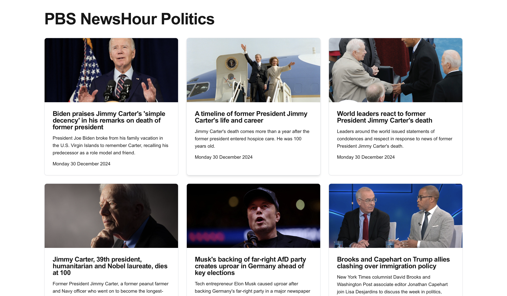

# PBS NewsHour RSS Reader

A simple React application that fetches and displays the PBS NewsHour Politics RSS feed using Next.js.



## Features

- Fetches PBS NewsHour Politics RSS feed
- Uses [Corsfix](https://corsfix.com) proxy to handle CORS issues
- Displays news items in a responsive grid layout
- Shows thumbnails, titles, descriptions, and publication dates
- Modern UI with shadcn-like styling

## Tech Stack

- Next.js
- React
- TypeScript
- Tailwind CSS

## Getting Started

1. Clone the repository
2. Install dependencies:
   ```bash
   npm install
   ```
3. Run the development server:
   ```bash
   npm run dev
   ```
4. Open [http://localhost:3000](http://localhost:3000) in your browser

## How It Works

The application fetches the PBS NewsHour Politics RSS feed through the corsfix proxy to bypass CORS restrictions:

```typescript
fetch('https://proxy.corsfix.com/?https://www.pbs.org/newshour/feeds/rss/politics')
```

The RSS feed is then parsed and displayed in a responsive grid layout with a clean, modern design.
